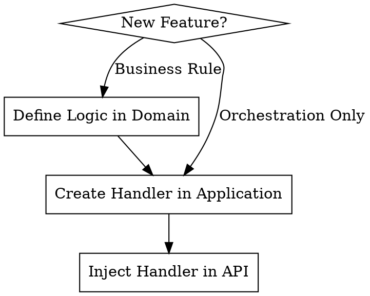

# Clean Architecture in .NET

## Overview

Clean Architecture organizes code into independent layers (Domain → Application → Infrastructure → API).

**The Iron Law**: Violating layer boundaries is a failure. If API references Application or Domain references Infrastructure, delete the change and start over.

## When to Use

- Business logic is leaking into Controllers or Repositories
- Circular dependencies occur between projects
- Need to isolate core business rules from external frameworks (EF Core, APIs)
- Autonomy is required: sealed Domain objects, strongly-typed IDs

## DDD vs POCO — Quick Decision

| Use | When |
|-----|------|
| `sealed class Foo : AggregateRoot` + factory method | The object has domain invariants, raises events, or owns child entities |
| Plain `sealed record Foo(...)` (POCO) | Pure data carrier, no invariants, used only inside Application or API (DTOs, ViewModels) |
| `sealed class Bar : ValueObject` | Immutable, identity-by-value, represents a domain concept (e.g., `PolicyNumber`, `Horsepower`) |

**Rule of thumb:** if you're tempted to add an `if` or `throw` to protect the object's state — it's a Domain object (aggregate or value object), not a POCO.

## Implementation Flow



## Core Pattern (CQRS)

Commands (writes) and Queries (reads) separate side-effects:

```csharp
// Application/Features/Orders/PlaceOrderCommandHandler.cs
public sealed class PlaceOrderCommandHandler : ICommandHandler<PlaceOrderCommand, OrderId>
{
    private readonly IOrderRepository _repository; // Interface defined in Application/Domain

    public async Task<OrderId> HandleAsync(PlaceOrderCommand cmd, CancellationToken ct)
    {
        var order = Order.Create(cmd.OrderId, cmd.CustomerName);
        await _repository.AddAsync(order, ct);
        return order.Id;
    }
}

// API/OrdersEndpoints.cs — inject ICommandBus (never ICommandHandler<,> directly)
app.MapPost("/orders", async (PlaceOrderCommand cmd, ICommandBus bus)
    => Results.Created($"/orders/{await bus.PublishAsync<PlaceOrderCommand, OrderId>(cmd)}"));

// Queries follow the same rule — inject IQueryBus
app.MapGet("/orders/{id}", async (Guid id, IQueryBus bus)
    => Results.Ok(await bus.SendAsync<GetOrderQuery, OrderViewModel>(new GetOrderQuery(new OrderId(id)))));

// Both buses resolve via Infrastructure DI. API never references Application assembly.
```

## Layer Responsibilities

| Layer | Purpose | Allowed Dependencies |
|-------|---------|----------------------|
| **SharedKernel** *(multi-context only)* | Generic interfaces + base classes only — zero domain logic | None |
| **Domain** | Pure business logic, aggregates | SharedKernel *(optional)* |
| **Application** | Use cases, Handler orchestration | Domain, SharedKernel *(optional)* |
| **Infrastructure** | Database, DI registration, CQRS Bus | Application, Domain |
| **API** | Endpoints, JSON mapping | **Infrastructure** (Transitive: Application, Domain) |

## Shared Kernel (Multi-Context Solutions)

Use a `SharedKernel` project when **two or more Bounded Contexts** need to share handler interfaces or base classes. It must contain **zero domain logic**.

```
SharedKernel/
├── Abstractions/
│   ├── ICommandHandler.cs   ← generic interface only
│   ├── IQueryHandler.cs
│   ├── ValueObject.cs       ← base class, no business logic
│   └── AggregateRoot.cs     ← base class, exposes DomainEvents collection
└── Events/
    └── DomainEvent.cs       ← abstract base for all domain events
```

**Dependency rule for SharedKernel:** it depends on **nothing**. Domain and Application reference it, not the other way around.

```csharp
// SharedKernel/Abstractions/ICommandHandler.cs — pure interface, no NuGet beyond System
public interface ICommandHandler<in TCommand, TResult>
{
    Task<TResult> HandleAsync(TCommand command, CancellationToken ct = default);
}

// Each context's Application layer implements it:
// Orders.Application/Features/PlaceOrder/PlaceOrderCommandHandler.cs
using SharedKernel.Abstractions;
public sealed class PlaceOrderCommandHandler
    : ICommandHandler<PlaceOrderCommand, OrderId> { }
```

**What NEVER goes in SharedKernel:** concrete value objects like `Money`, `Address` (each context defines its own); aggregate logic; context-specific event types.

## Domain Events

**Rule:** Domain events are **declared in the Domain layer** and **dispatched in the Application layer** (from the handler, after the aggregate operation succeeds).

```csharp
// Domain/Orders/Events/OrderPlacedEvent.cs — sealed, in Domain
public sealed class OrderPlacedEvent : DomainEvent  // DomainEvent base from SharedKernel (or Domain if single-context)
{
    public OrderId OrderId { get; }
    public OrderPlacedEvent(OrderId orderId) => OrderId = orderId;
}

// Domain/Orders/Order.cs — aggregate raises the event
public sealed class Order : AggregateRoot
{
    public static Order Create(OrderId id, CustomerId customerId)
    {
        var order = new Order(id, customerId);
        order.AddDomainEvent(new OrderPlacedEvent(id)); // ← raised in Domain
        return order;
    }
}

// Application/Features/PlaceOrder/PlaceOrderCommandHandler.cs — handler dispatches
public sealed class PlaceOrderCommandHandler : ICommandHandler<PlaceOrderCommand, OrderId>
{
    private readonly IOrderRepository _repository;
    private readonly IDomainEventDispatcher _dispatcher; // interface in Application/Domain

    public async Task<OrderId> HandleAsync(PlaceOrderCommand cmd, CancellationToken ct)
    {
        var order = Order.Create(cmd.OrderId, cmd.CustomerId);
        await _repository.AddAsync(order, ct);
        await _dispatcher.DispatchAsync(order.DomainEvents, ct); // ← dispatched in Application
        return order.Id;
    }
}
```

**Anti-pattern:** Never dispatch events from inside a Domain aggregate method — Domain has no dependency on dispatch infrastructure.

## The Dependency Chain (Transitive Access)

The architecture follows a strict outward-in dependency flow:
**API** → **Infrastructure** → **Application** → **Domain**

- **API** has access to everything below it (Infrastructure, Application, Domain).
- **Infrastructure** has access to Application and Domain.
- **Application** has access to Domain.
- **Domain** remains pure with **zero** project dependencies.

**CRITICAL**: Just because a layer *can* see another via transitive reference doesn't mean it *should* use its concrete types.
- API should only use **Interfaces** from Application/Domain.
- Always follow the **Iron Law** and **Red Flags** below.

## Rationalization Table

| Excuse | Reality |
|--------|---------|
| "Injecting ICommandHandler<,> directly is simpler" | Always use ICommandBus / IQueryBus — consistent indirection, easier to intercept (logging, validation). |
| "It's just one small service" | Small leaks become circular dependency nightmares. |
| "Referencing Application in API is faster" | It bypasses the Bus/Handler pattern and couples contract to implementation. |
| "Domain needs this NuGet package" | If it's not a primitive/System lib, it doesn't belong in Domain. |

## Red Flags - STOP and Start Over

- `using MyApp.Application;` inside API layer files
- `using MyApp.Infrastructure;` inside Domain layer files
- Injecting `ICommandHandler<,>` or `IQueryHandler<,>` directly in API endpoints — use `ICommandBus` / `IQueryBus`
- Non-sealed classes in Domain
- Handlers performing HTTP calls directly (use an Infrastructure service via interface)

## Common Mistakes

| Mistake | Fix |
|---------|-----|
| Handler not found by DI | Handler must be listed explicitly in `AddInfrastructure()` via `AddHandler<T>()` |
| `using MyApp.Application;` in API | Remove it — inject `ICommandBus` / `IQueryBus` via DI |
| `Guid` used in handler return type | Use strongly typed ID (`OrderId`, `ProductId`) |
| Read result named `ProductDto` | Name it `ProductViewModel` to distinguish from transfer objects |
| `typeof(Product).Assembly` in tests | Use `typeof(IApplicationMarker).Assembly` for reliable discovery |
| Non-sealed Domain classes | All Domain classes must be `sealed` (enforced by NetArchTest) |
| SharedKernel references Domain | SharedKernel must depend on **nothing** — if it references Domain, invert: Domain references SharedKernel |
| Handler contains `if`/business logic | Delegate to Domain aggregate methods — handlers orchestrate only |

---

## References

- [Architecture Layers](references/architecture-layers.md) — Dependency rules, marker interfaces, layer tests, and layer validation with NetArchTest
- [CQRS Patterns](references/cqrs-patterns.md) — Handler interfaces, examples, DI discovery, and complete CQRS implementation patterns
- [Convention-Based DI](references/convention-based-di.md) — Auto-discovery, Bus interfaces, full DI setup
- [Layer Responsibilities](references/layer-responsibilities.md) — Full rules for each layer with DDD context
- [Project Structure](references/project-structure.md) — File/folder conventions and layer organization guidance
- [NetArchTest Rules](references/netarchtest-rules.md) — Automated boundary enforcement
- [DDD Patterns](references/ddd.md) — Aggregates, factory methods, value objects, and domain events (optional)
- [Shared Kernel](references/shared-kernel.md) — Shared abstractions for multi-context solutions (optional)
- [Init Script](scripts/init-project.sh) — Bootstrap script for new project setup (`./init-project.sh MyApp`)
- [ArchitectureTests Template](templates/IntegrationTests/ArchitectureTests.cs) — Drop-in architecture test template
